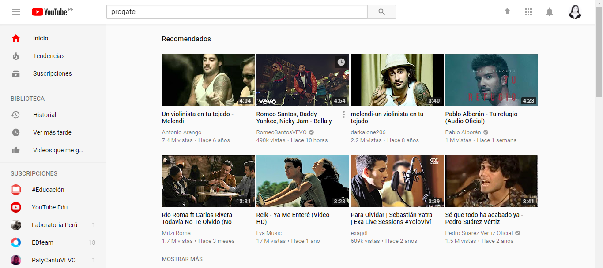

# Proyecto -Reto N° 01

## Objetivos

 Elige una web de tu preferencia y explica qué partes conforman el UX y qué partes el UI

- Pinterest
- Youtube
- Laboratoria

 En este caso he elegido Youtube

## Capturamos la Pantalla

 

## UX vs. UI

 A continuación se evalúa al usuario, tanto para UX como para UI.

| ITEM | UX       | UI     |
| :---: | :---: | :---: |
|  1   | Represetación de la marca y el país. | Diseño del logo (rojo y blanco) y la ubicación de este. |
|  2   | Que pueda opciones de navegación | Diseño y colo de la barra de navegación |
|  3   | Represetación de la marca y el país. | Diseño del logo (rojo y blanco) y la ubicación de este. |
|  4   | Que pueda ver recomendaciones de tendencias según sus gustos | Presentación de las tendencias en pequeños videos 
|  5   | Consultar canales suscritos | Icono y ubicación de la opción suscripciones |
|  6   | Texto y palabras de las opciones | Tipo de letra y color de las opciones de navegación |
|  7   | Que pueda hacer una busqueda general | La forma, la ubicación y el ícono de la caja de búsqueda |
|  8   | Que pueda agregar videos a favoritos, me gusta y ver mas tarde | La ubicación y el ícono de cada opción|
|  9   | Que el usuario se sienta identificado | La imagen o la foto del usuario, la forma redondeada y la ubicación |
|  10  | Que pueda enviar comentarios | La forma y la presentacion de los comentarios, el tipo de letra a utilizar |
|  11  | Que pueda pedir ayuda | El ícono y el lugar donde se coloca el ícono para pedir ayuda |
|  12  | Que pueda hacer la carga de sus propios videos | Un botón cargar |
|  13  | Que pueda ver lista de reproducción basada en artistas | Ubiación y presentación de las listas de reproducción |
|  14  | Que pueda eligir el idioma de la aplicación | Presentación del menú para el cambio del idioma|
|  15  | Que el pueda poner subtítulos | Presentación e ícono para poner subtítulos |
|  16  | Que pueda traducir automaticamente os videos | La presentación del menú para subtitulos y la letra de los subtítulos la ubicación de ellos |
|  17  | Que pueda seleccionar la calidad del video | La presentación del menú para seleccionar la calidad del video |
|  18  | Que pueda seleccionar la velocidad de reproduccion | La presentación del menú de la velocidad de reproduccion |
